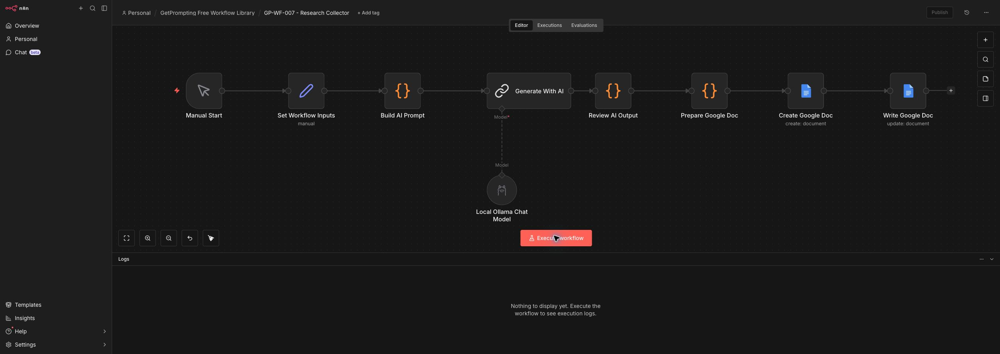
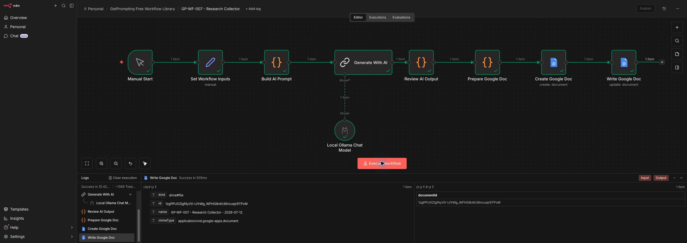
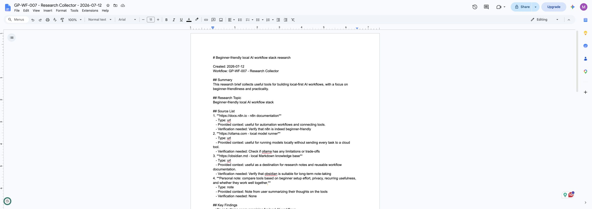

# Research Collector

Organize saved links, snippets, and rough research notes into a practical research brief.

This workflow is part of the GetPrompting Free Workflow Library. It is built as a practical starter workflow: simple enough to inspect, useful enough to run, and flexible enough to customize.

## What It Does

- Uses editable n8n inputs for research topic, research goal, target audience, saved items, source-handling rules, and knowledge-base destination
- Sends the structured request to a local Ollama chat model
- Reviews and formats the AI response with readable JavaScript nodes
- Creates a Google Doc for the final output
- Leaves the human in charge of reviewing and using the result

## Why This Exists

Useful links get saved everywhere and then disappear when it is time to write or decide.

The point is not to create a giant automation system. The point is to give you a small, understandable workflow you can run, study, and adapt.

## Output

The workflow creates a Google Doc with sources, themes, findings, assumptions, follow-up questions, next actions, and tags.

## Screenshots

### Workflow Overview

### Successful Test Run

### Google Docs Output

## Requirements

- n8n
- Ollama running locally
- A local chat model, such as `llama3.1:8b`
- Google Docs credentials connected inside n8n

## Quick Start

1. Download or clone this repository.
2. Import `workflow.json` into n8n.
3. Make sure Ollama is running on your machine.
4. In n8n, connect your Google Docs credential to the Google Docs nodes.
5. Confirm the Ollama model name matches a model installed locally.
6. Run the workflow manually.
7. Open the Google Doc it creates and review the output.

For more detail, see [Installation](docs/installation.md).

## Files

- `workflow.json` - clean n8n workflow export with no private credential references
- `examples/sample-input.md` - example input you can adapt
- `examples/sample-output.md` - example finished output
- `docs/installation.md` - setup instructions
- `docs/customization.md` - ways to adapt the workflow
- `docs/troubleshooting.md` - common issues and fixes

## Important Notes

This workflow uses local AI for the reasoning step, but it writes the final output to Google Docs. If you want a fully local version, replace the Google Docs nodes with a local file, Obsidian note, Notion page, database record, or another destination.

The included workflow does not contain private credentials, API keys, OAuth tokens, or personal account details.

## License

MIT License. Use it, remix it, and build something useful with it.
